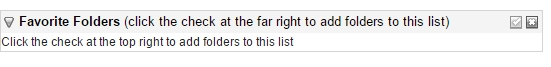
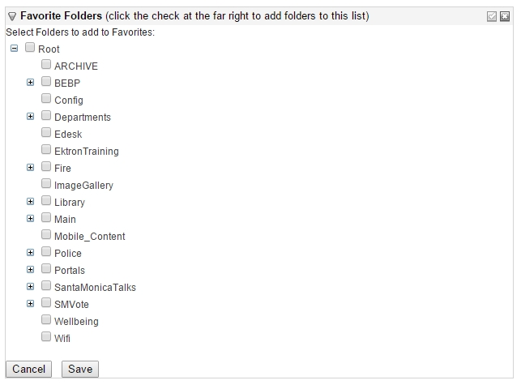
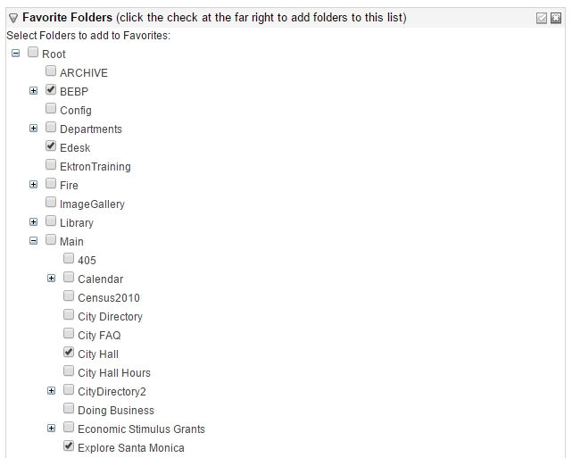
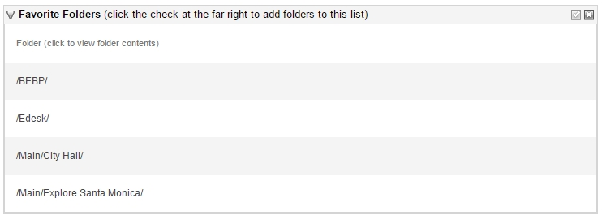

#EktronFavoriteFolders

An Ektron workarea widget to display a customizable list of "favorite folders" for the current logged in user.

This widget was developed and tested against Ektron 8.6.1.

## Usage

Ektron workarea widgets are displayed on the so-called *Smart Desktop*, which is found under the **Desktop** tab in the Workarea.

See the [Ektron documentation](http://documentation.ektron.com/cms400/v8.61/Reference/Web/EktronReferenceWeb.html#Content/Managing_Content.htm#Using) 
for details of using and configuring the *Smart Desktop*. This usage will assume you have enabled *Smart Desktop Widgets* and have added the `FavoriteFolders` widget
according to Ektron's documentation.

When users first log in and view the *Smart Desktop*, with the `FavoriteFolders` widget added, they will be presented with an empty grid, similar to:

This shows that the user hasn't selected any favorite folders yet.

To do so, click the checkmark at the top right of the widget's title bar. This brings the widget into *Edit* mode, where a user sees a tree view of the Ektron folder structure:

From there, the user may check any number of folders, at any level, to save to their list of favorites.

After the user's selection is saved, they are again presented with a grid. This time, they see each of the selected folders as a *link*. Clicking on a given link navigates the user directly to that folder in the Workarea.

The user can edit their favorite folders selection at any time, by clicking the checkmark at the top right of the widget's title bar.
